# Installing MCM App using HelmRepo Channel in IBM Cloud Pak for Multicloud Management Version 1.3.0 

## 1. Installation Steps

1. Download this project from git

2. Change the below values according to your cluster in the file `/src/03-subscription/21-placement.yaml`. 

```
  clusterLabels:
    matchExpressions:
      - key: name
        operator: In
        values:
          - ocp43-mcm-gan-a
```

3. Goto `install` folder in command prompt

4. Set kubetcl context in command prompt that points to your mcm hub.

5. Run the below command.

```
sh 01-install.sh
```

-------------

## 2. Accessing the installed application

The application get installed in the mcm hub.

1. Login into the managed cluster with ` oc login`  command

2. Run the below command to find the routes installed.

```
oc get route -n gstore-helm-app-ns
```

It may result like the below.
```
NAME           HOST/PORT                                                                                                                 PATH   SERVICES       PORT      TERMINATION   WILDCARD
gstore-sales   gstore-sales-gstore-helm-app-ns.ocp43-mcm-gan-a-.appdomain.cloud   /      gstore-sales   my-http                 None

```

3. Copy the route from the above output and open the url in the browser.

ex:
```
http://gstore-sales-gstore-helm-app-ns.ocp43-mcm-gan-a-.appdomain.cloud
```

----------

## 3. Viewing App Topology

The deployed application would be like this in MCM Hub console.

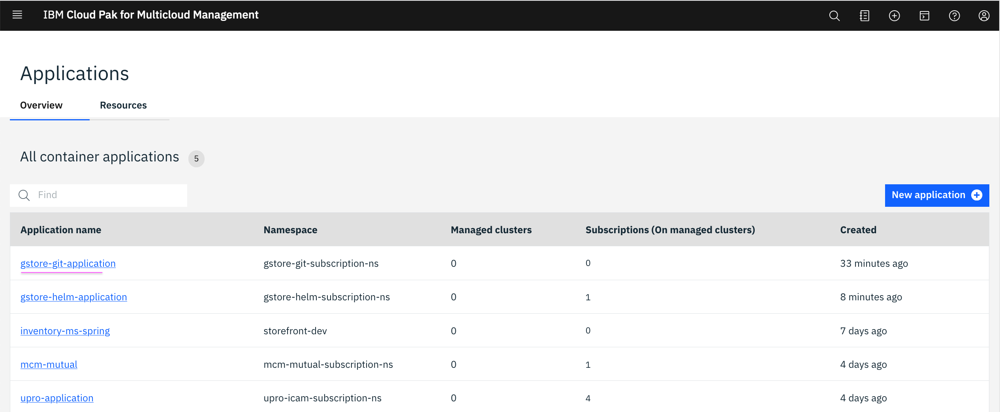

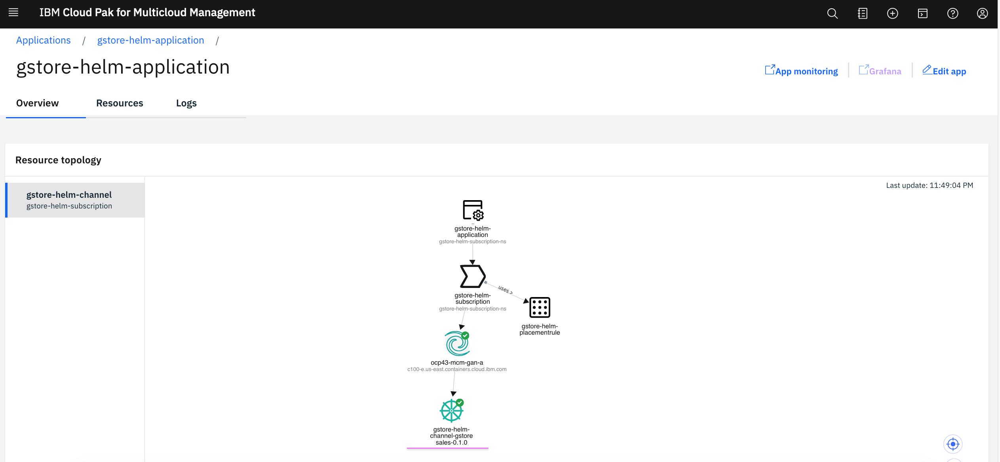

----------

## 4. Application resources Yaml files explained

Here is some details regarding yaml files used in the application located under `src` folder.

#### Channel

Placeholder for the Deployable yaml files. Here it is pointing to Helm repo. (To this same repo)

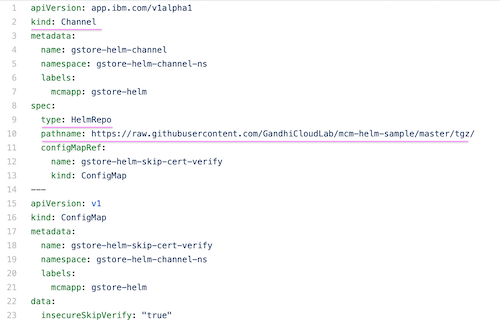

#### Application

To group the components

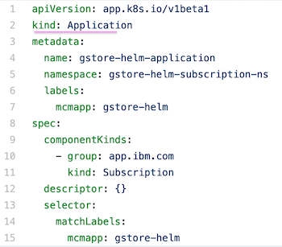

#### Placementrule

To define the target cluster

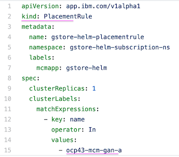

#### Subscription

To bind the channel with the placement rule. 

Also it specifies the sub path of the deployables under the helm repo referred by the channel. Here `gstoresales` is the path and `package version is 0.1.0`.

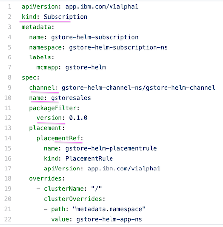

#### Namespace

Namespaces to deploy the app, channel and subscriptions.

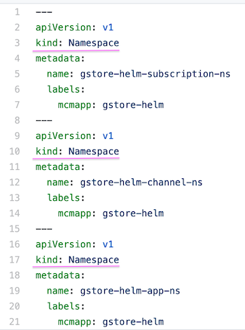

#### Helm repo 

The Helm repo sub path where the deployables are stored.

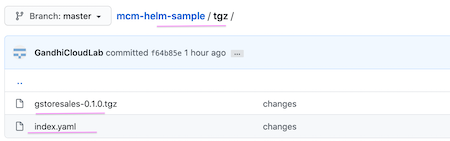

The actual helm repo chart scripts are available in the folder.

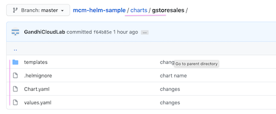


#### Scripts

Here is the scripts available to prepare helm repo charts.

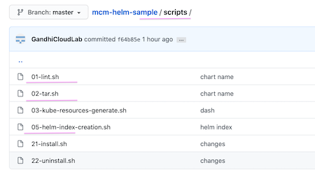

1. `01-lint.sh` will compile the helm repo scripts.

2. `02-tar.sh` will create tgz file from the helm repo scripts and move it to `tgz` folder.

3. `05-helm-index-creation.sh` will make helm repo index using the above created `tgz` file in the `tgz` folder.

#### Deployment

Kubernetes resource  Deployment

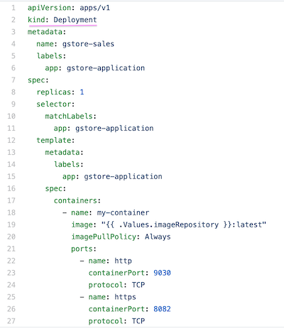

#### Service

Kubernetes resource  Service

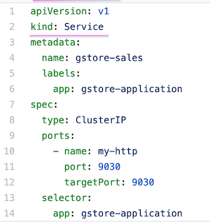

#### Route

Openshift resource  Route

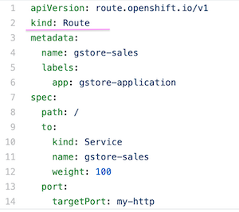


